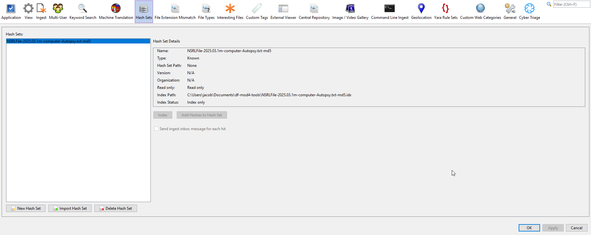
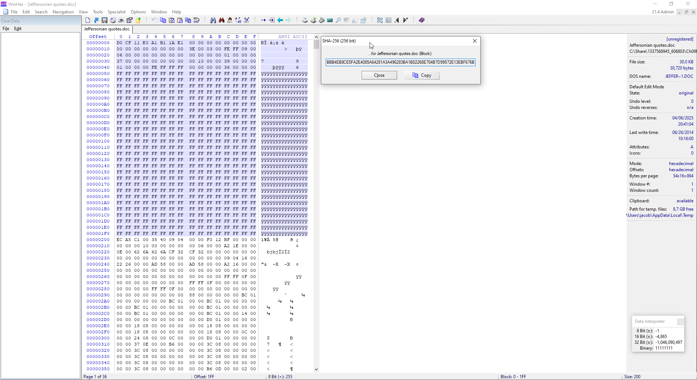
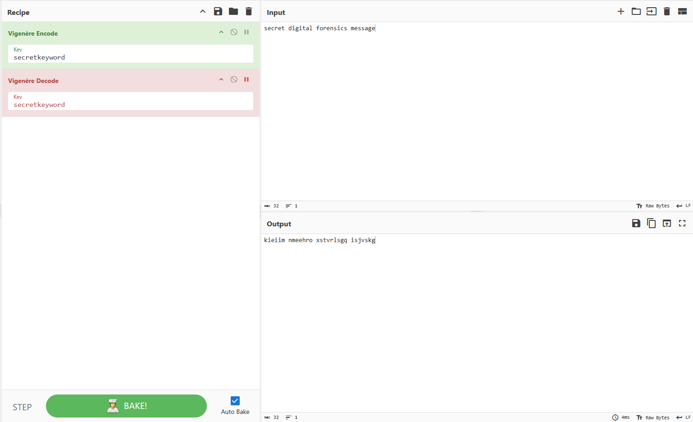
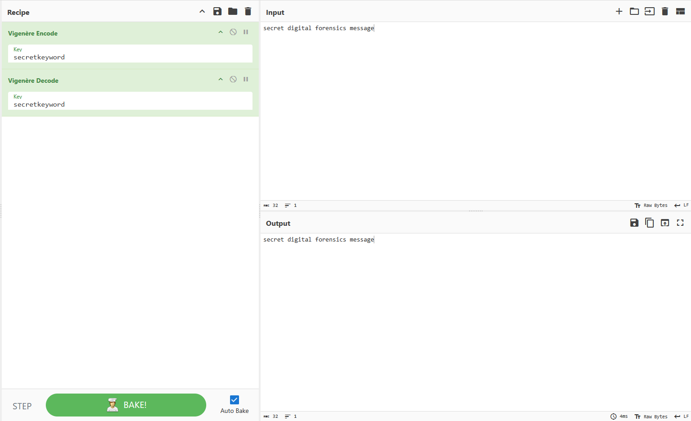

## 1: Import Hash Database

Quickly importing hash databases is important in being able to quickly reference and utilize different hash sets, a convenience that would otherwise be more complex if hash databases were installed manually.

## 2: Create Hash Database

Being able to quickly generate a hash set by just pasting a hash set is very important in investigations where the same files are being seen throughout different sets of data, allowing for Autopsy to quickly match these files and categorize them based off of hash sets.

## 3: Match File Remnants

While hashing an entire file will show if the file has changed, hashing small blocks of data can be more vital to understanding what and where exact parts of the file have changed.

## 4: Simple Encryption

Although a very simple form of encryption, understanding how to notice and decode bit-shifted files is important in versatility to digital forensics investigations and uncovering obfuscated evidence.

## Bonus
- `live-hash-lookup.ps1` - A script that doesn't save a rainbow table, and instead loops through each potential passcode, comparing the pre-entered hashes.
- `rainbow-table.ps1` - A script that generates a proper rainbow table based on the same set of passcodes  
Very quickly after testing the live hash lookup did I realize why generating a single rainbow table once is a more logical choice due to the speed. Neither script implements any multi-threading logic, taking just under 11 minutes for a full generation on an R9 7940HX.  
### Discovered passcodes:
Erik: 783425 (9e89895d350e5fdac013006b2acb067f8516149cdf7e952b021ff0326718ab70)  
Logan: 783436 (af95a5393589cace29a63eead5328f1647a8bc62b5ef18b023c574484a877ced)  
Cody: 783457 (30fc150e7c8b42dd86b1bb6e67ee256be8230969bb37cc111749e87af383ae82)